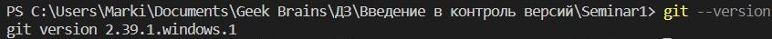

# __Начальная работа с системой контроля версий__ #

* __git --version__ - _комманда для проверки версии git_

* __git init__ - _инициализируем пустой репозиторий_

* __git status__ - _проверяем текущее состояние файлов_

* __git add имя_файла_с_расширением__ - _добавляем версионность файлу_

* __git add .__ - _добавляем версионность всем файлам в папке_

* __git commit -m "Сообщение"__ - _команда для фиксации изменений файлов_

* __git commit -am "Сообщение"__ - _фиксация изменений с комментарием (не требует git add)_

* __git diff__ - _вывод изменений на текущий момент, по отношению к последнему коммиту_

* __git log__ - _вывод истории коммитов в хронологическом порядке_

* __git checkout хэш_коммита__ - _переход между изменениями_

* __git chekout master__ - _возврат к текущему состоянию_