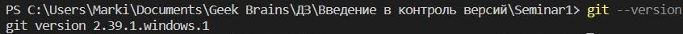

# __Начальная работа с системой контроля версий__

## __Основные комманды git:__

---

* __git --version__ - _комманда для проверки версии git_

* __git init__ - _инициализируем пустой репозиторий_

* __git status__ - _проверяем текущее состояние файлов_

* __git add имя_файла_с_расширением__ - _добавляем версионность файлу_

* __git add .__ - _добавляем версионность всем файлам в папке_

* __git commit -m "Сообщение"__ - _команда для фиксации изменений файлов_

* __git commit -am "Сообщение"__ - _фиксация изменений с комментарием (не требует git add)_

* __git diff__ - _вывод изменений на текущий момент, по отношению к последнему коммиту_

* __git log__ - _вывод истории коммитов в хронологическом порядке_

* __git checkout хэш_коммита__ - _переход между изменениями_

* __git chekout master__ - _возврат к текущему состоянию_

---

## Оформление шрифтом Mardown

---

ЗАГОЛОВКИ

---

* __Заголовки__ оформляются символом __#__
    >Уровень заголовка определяется по количеству начальных символов:
    >>"#" - Первый уровень заголовка  
    >>"##" - Второй уровень заголовка и т.д.  
  
* __Выделение заголовков__ с помощью подчеркивания производится знаками равенства __"="__ в случаем, если заголовок __первого уровня__, и дефисами __"-"__ в случае, если заголовок второго уровня.
    >Заголовок первого уровня  
    ==================  
    Заголовок второго уровня  

---

ЦИТАТЫ

---

* Для обозначения цитат в языке Markdown используется знак «больше» __(«>»)__. Его можно вставлять как перед каждой строкой цитаты, так и только перед первой строкой параграфа.

    >Это пример цитаты  

* Также синтаксис Markdown позволяет создавать вложенные цитаты (цитаты внутри цитат). Для их разметки используются дополнительные уровни знаков цитирования (">").  
Уровень цитаты определяется по количеству начальных символов ">", ">>" и т.д.
    >Цитата __первого__ уровня  
    >>Цитата __второго__ уровня _(цитата внутри цитаты)_  
    >>>Цитата __третьего__ уровня и _так далее_  

* При вставке цитат в элементы списка важно учитывать, что элементы списка должны находиться на одном уровне, а цитаты должны указываться с отступом. В случае, если правило с единым уровнем списка не соблюдается, следующий после цитаты элемент списка будет автоматически нумероваться цифрой «1.». Кроме того, при необходимости в список можно вставить исходный код. В этом случае его нужно писать с двойным отступом – 8 пробелов или 2 символа табуляции.

